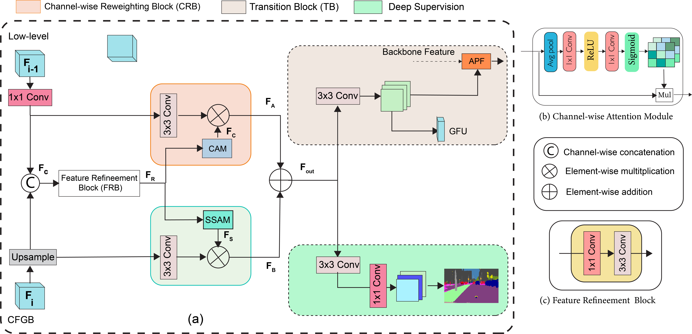

# S<sup>2</sup>-FPN: Scale-ware Strip Attention Guided Feature Pyramid Network for Real-time Semantic Segmentation

This project contains the Pytorch implementation for the proposed S<sup>2</sup>-FPN: [[Arxiv]](http://arxiv.org/abs/2206.07298).

### Introduction

Modern high-performance semantic segmentation methods employ a heavy backbone and dilated convolution to extract the relevant feature. Although extracting features with both contextual and semantic information is critical for the segmentation tasks, it brings a memory footprint and high computation cost for real-time applications. This paper presents a new model to achieve a trade-off between accuracy/speed for real-time road scene semantic segmentation. Specifially, we proposed a lightweight model named Scale-aware Strip Attention Guided Feature Pyramid Network (S<sup>2</sup>-FPN). Our network consists of three main modules: Attention Pyramid Fusion (APF) module, Scale-aware Strip Attention Module (SSAM), and Global Feature Upsample (GFU) module. APF adopts an attention mechanisms to learn discriminative multi-scale features and help close the semantic gap between different levels. APF uses the scale-aware attention to encode global context with vertical stripping operation and models the long-range dependencies, which helps relate pixels with similar semantic label. In addition, APF employs channel-wise reweighting block (CRB) to emphasize the channel features. Finally, the decoder of S<sup>2</sup>-FPN then adopts GFU, which is used to fuse features from APF and the encoder. Extensive experiments have been conducted on two challenging semantic segmentation benchmarks, which demonstrate that our approach achieves better accuracy/speed trade-off with different model settings. The proposed models have achieved a results of 76.2%mIoU/87.3FPS, 77.4%mIoU/67FPS, and 77.8%mIoU/30.5FPS on Cityscapes dataset, and 69.6%mIoU,71.0% mIoU,and 74.2% mIoU on Camvid dataset.
                The detailed architecture of S<sup>2</sup>-FPN

<p align="center"></p>

                Attention Pyramid Fusion Module

<p align="center"></p>

### Updates

1. S2FPN works with [ResNet18,ResNet34,ResNet50,ResNet101,ResNet152]. We tested it with ResNet18 and 34.
1. upload pretrained weights


### Installation

1. Pyroch Environment

- Env: Python 3.6; PyTorch 1.0; CUDA 10.1; cuDNN V8
- Install some packages

```
pip install opencv-python pillow numpy matplotlib
```

1. Clone this repository

```
git clone https://github.com/mohamedac29/S2-FPN
cd S2-FPN
```

3. Dataset

You need to download the [Cityscapes](https://www.cityscapes-dataset.com/), and put the files in the `dataset` folder with following structure.

```
├── cityscapes_test_list.txt
├── cityscapes_train_list.txt
├── cityscapes_trainval_list.txt
├── cityscapes_val_list.txt
├── cityscapes_val.txt
├── gtCoarse
│   ├── train
│   ├── train_extra
│   └── val
├── gtFine
│   ├── test
│   ├── train
│   └── val
├── leftImg8bit
│   ├── test
│   ├── train
│   └── val
```

- Convert the dataset to [19 categories](https://github.com/mcordts/cityscapesScripts/blob/master/cityscapesscripts/helpers/labels.py).

- Download the [Camvid](https://github.com/alexgkendall/SegNet-Tutorial/tree/master/CamVid) dataset and put the files in the following structure.

```
├── camvid_test_list.txt
├── camvid_train_list.txt
├── camvid_trainval_list.txt
├── camvid_val_list.txt
├── test
├── testannot
├── train
├── trainannot
├── val
└── valannot


```

### Pretrained Weights

You can download the pretrained weights. There are some differences in the 
accuracy listed here
- Camvid and Cityscapes Datasets. FPS computed based on GTX1080Ti

|     Dataset      |  Pretrained  | Train type |    mIoU    |  FPS  |                                                                    model                                                                     |
| :--------------: | :----------: | :--------: | :--------: | :---: | :--------------------------------------------------------------------------------------------------------------------------------------------: |
| Cityscapes | ResNet18 |  train  | **76.3%** | 87.3 | [ckpt](https://drive.google.com/file/d/1XI8jNAm1C5anW9ExJvneddhYAaIPdOHa/view?usp=sharing)|
| Cityscapes | ResNet34 |    |  |  |  |
| Cityscapes | ResNet34M|    |  |  |  |
| CamVid     | ResNet18 |  trainval  | **70.1%** | 124.2 | [ckpt](https://drive.google.com/file/d/1H1iTzYaP8CbuDeeW0phnvCTBigHe8CD8/view?usp=sharing)         |
| CamVid     | ResNet34 |  trainval  | **71.0%** | 107.2 |     |
| CamVid     | ResNet34M |  trainval  | **74.76%**  |55.5  | [ckpt](https://drive.google.com/file/d/1XI8jNAm1C5anW9ExJvneddhYAaIPdOHa/view?usp=sharing)       |


### Training 

- Training on Camvid datsaset
```
python train.py --dataset camvid --model SSFPN --max_epochs 150 --train_type trainval --lr 3e-4 --batch_size 8
```
- Training on Camvid datsaset - train_type [trainval,trainval]
```
python train.py --dataset cityscapes --model SSFPN --max_epochs 500 --train_type trainval --lr 3e-4 --batch_size 8
```
### Testing 
- Testing on Camvid datsaset
```
python test.py --dataset camvid --model SSFPN --checkpoint ./checkpoint/camvid/SSFPNbs8gpu1_trainval/model_150.pth --gpus 0
```
- Testing on Cityscapes datsaset
```
python test.py --dataset cityscapes --model SSFPN --checkpoint ./checkpoint/cityscapes/SSFPNbs8gpu1_trainval/model_500.pth --gpus 0
```
### Inference Speed
- Inference speed with input resolution 512x1024
```
python eval_fps.py 512,1024
```

### Citation

If you find this work useful in your research, please consider citing.

```
@article{elhassan2022s,
  title={S<sup>2</sup>-FPN: Scale-ware Strip Attention Guided Feature Pyramid Network for Real-time Semantic Segmentation},
  author={Elhassan, Mohammed AM and Yang, Chenhui and Huang, Chenxi and Legesse Munea, Tewodros and Hong, Xin},
  journal={arXiv e-prints},
  pages={arXiv--2206},
  year={2022}
}
```
